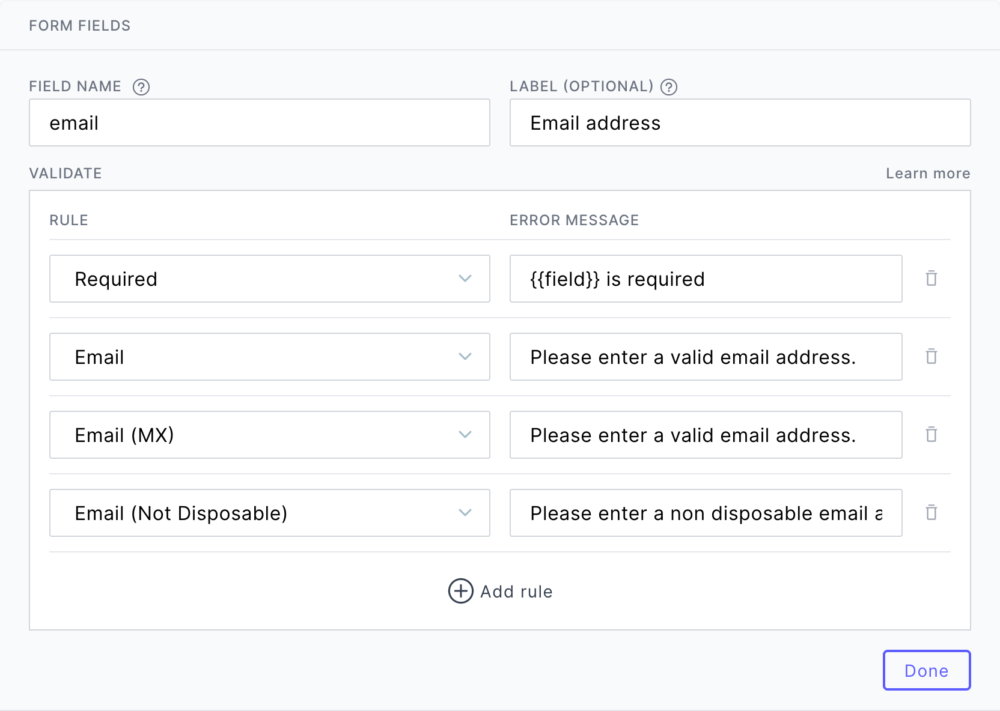

# Schema & Validation

POST2 provides a no code way to define your form schema, fields, validation rules and errors for your form inputs.

Enabling **strict schema** will exclude any additional fields not defined in the form schema.

## Validation Rules

| Rule               | Parameters | Description                                                                               |
| ------------------ | ---------- | ----------------------------------------------------------------------------------------- |
| required           | _none_     | Requires non-empty data. Checks for empty arrays and strings containing only whitespaces. |
| alphanumeric       | _none_     | Accepts only alphanumerics. (0-9, A-Z, a-z)                                               |
| email              | _none_     | Accepts valid email address format.                                                       |
| email (MX)         | _none_     | Accepts valid email address format + check if has MX records                              |
| email (disposable) | _none_     | Accepts valid email address format + check if the email is not disposable                 |
| url                | _none_     | Accepts only URLs.                                                                        |
| minLength          | min        | Requires the input to have a minimum specified length, inclusive.                         |
| manLength          | max        | Requires the input to have a maximum specified length, inclusive.                         |
| lengthBetween      | min, max   | Requires the input to have the length between specified min/max, inclusive.               |
| minValue           | min        | Requires input to have a specified minimum numeric value.                                 |
| manValue           | max        | Requires input to have a specified maximum numeric value.                                 |
| valueBetween       | min, max   | Requires the input to have the value between specified min/max, inclusive.                |
